# Architecture Diagrams — Gym Member Fitness PWA

Phase: Phase 1 — System Architecture
Version: 0.1.0
Date: 2026-08-19

All diagrams use Mermaid. They are architectural diagrams; final UI is deferred to Phase 7.

---

## D1 — High-Level System Architecture

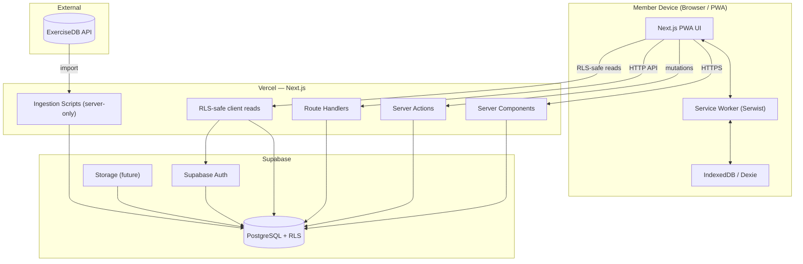

---

## D2 — Authentication Flow

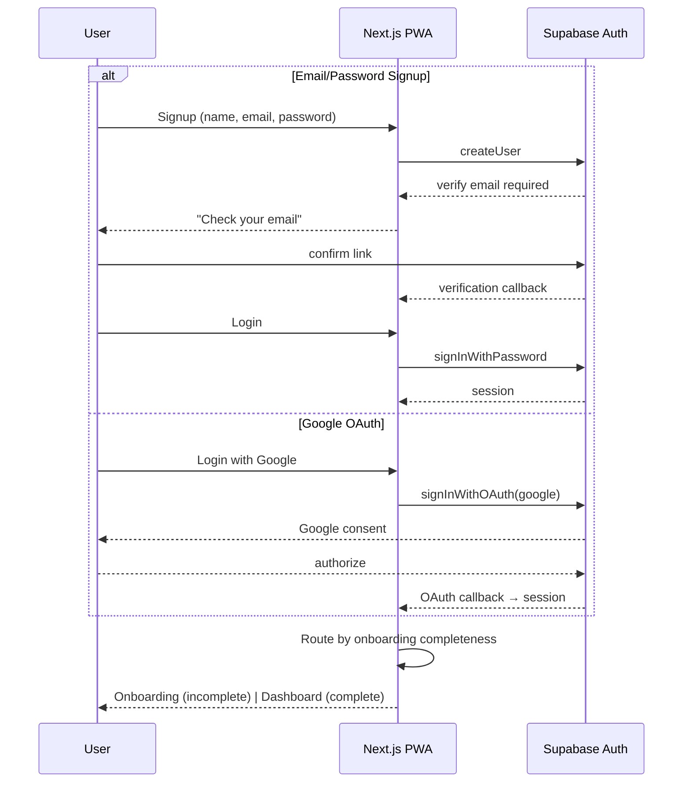

---

## D3 — Request / Data Flow

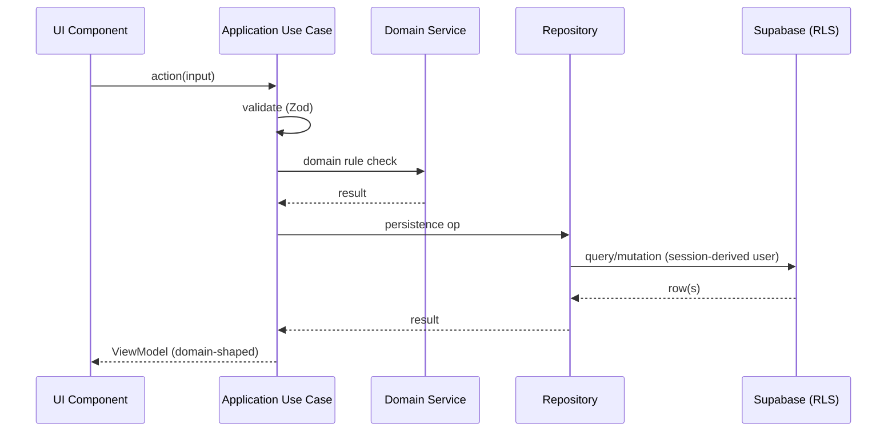

---

## D4 — Plan-Generation Flow

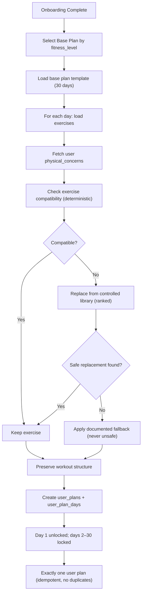

---

## D5 — Workout Player State Diagram

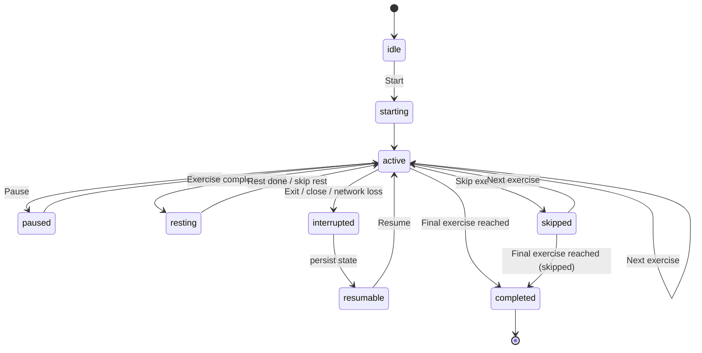

Note: reaching `completed` is allowed even if exercises were `skipped`.

---

## D6 — Offline Architecture

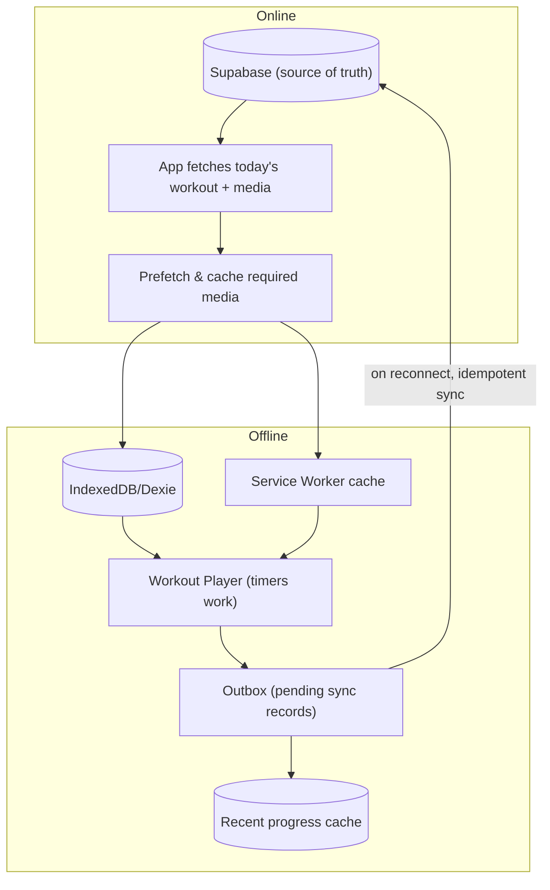

---

## D7 — Offline Synchronization Sequence

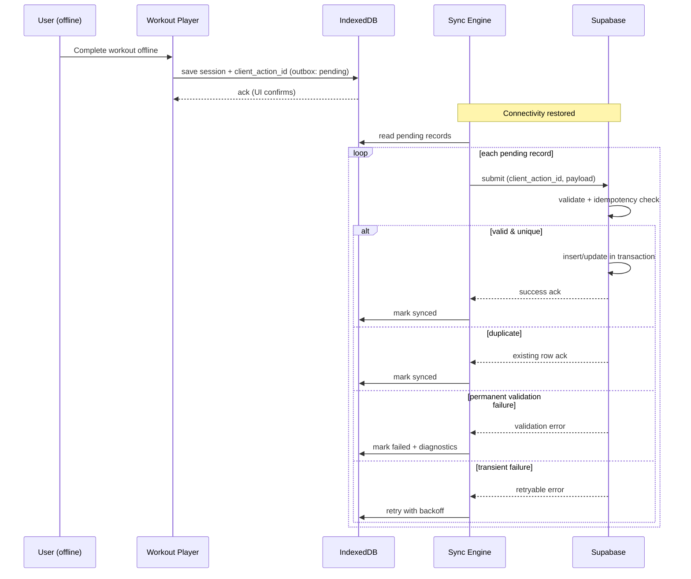

---

## D8 — Discover Personalization Flow

```mermaid
flowchart TD
    A["User opens Discover workout"] --> B["Fetch workout + exercises"]
    B --> C["Fetch user physical_concerns"]
    C --> D{"Any incompatible exercise?"}
    D -- No --> E["Present original workout"]
    D -- Yes --> F["Replace each incompatible exercise (ranked deterministic)"]
    F --> G{"All replaced safely?"}
    G -- Yes --> H["Present modified workout"]
    G -- No --> I["Apply documented fallback (mark unavailable / safe fallback / adjust duration + explain)"]
    H --> J["User sees final (modified) workout"]
    I --> J
    E --> K["Start → Workout Player (source=discover)"]
    J --> K
    Note over A,J: Original fixed workout is NEVER modified globally.
```

---

## D9 — ExerciseDB Ingestion Flow

```mermaid
flowchart LR
    A["ExerciseDB API"] --> B["Fetch (paginated, throttled)"]
    B --> C["Validate (Zod)"]
    C --> D["Map / Normalize to internal DTO"]
    D --> E["Add our taxonomy (focus areas, levels)"]
    E --> F["Add safety metadata + restrictions"]
    F --> G["Add equipment relationships"]
    G --> H["Store in PostgreSQL (external_source + external_exercise_id)"]
    H --> I["Curate workouts + base 30-day plans"]
    I --> J["Member application reads from DB"]
```

---

## D10 — Data Ownership / Trust Boundary Diagram

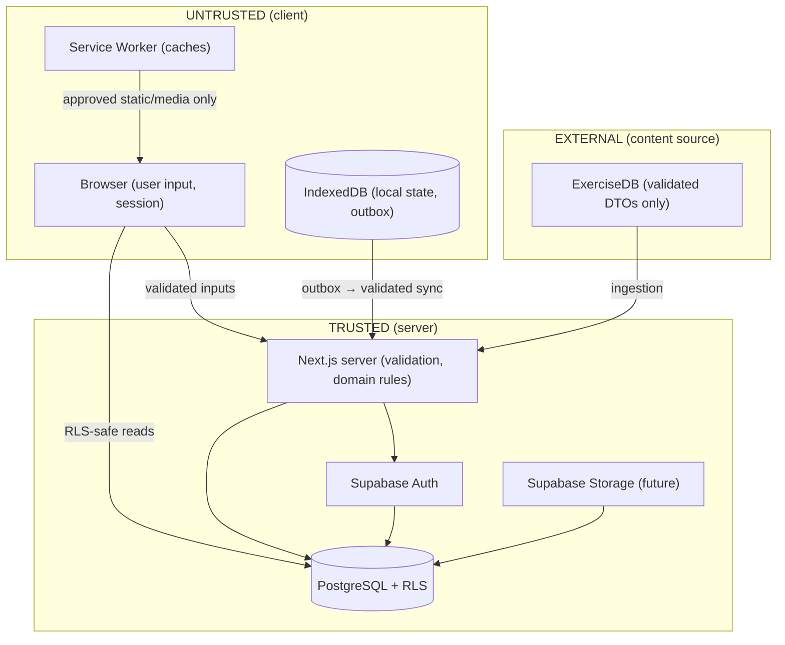

---

## D11 — Deployment Architecture

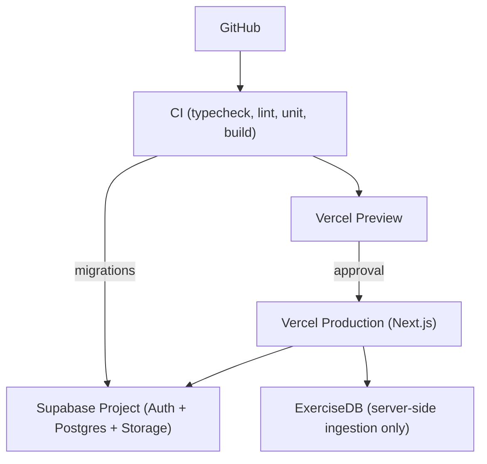

---

## D12 — Environment Architecture

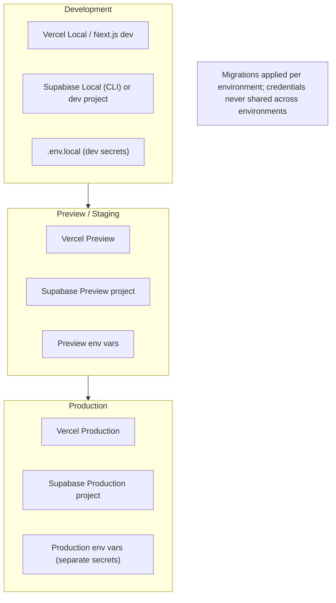
